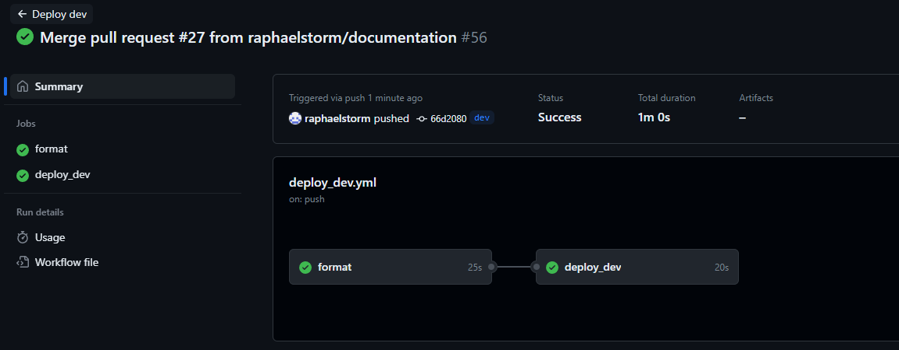

# iacOblig2
*Raphael Storm Larsen* | *raphaesl@stud.ntnu.no* | *04/11/2023*  

Repository: https://github.com/raphaelstorm/iacOblig2

## Usage Guide

### Script Usage Guide

This Terraform configuration demo is a slightly modified version of the lab 7 demo. It creates a virtual network containing one virtual machine. The VM includes a disk and NIC with a public IP attached. Additionally, a storage account is created to hold the container. Most resources have names that can be edited within the `variables.tf` script. Keep in mind that the Terraform configuration still uses its own prefix and suffix for most resources.

### Branches

This repository structure primarily uses two branches: `dev` and `main`. The intention is to conduct work on specific tasks within environment branches, which are then merged into the `dev` branch via pull requests. Code quality checks are performed upon creating a pull request with the `dev` branch. After the checks have passed and the branches have merged, `dev` will automatically clean up any code issues, and the new version is deployed to Azure under the `dev` suffix.

Once a new version is ready for release, a pull request is created towards the `main` branch from the `dev` branch. First, a new version of the infrastructure is tested under the `stage` suffix. Tests are then conducted on the live code in this environment. If all checks pass, and at least one person has personally approved the merge, then the `dev` branch may be merged with the `main` branch. The `main` branch automatically deploys, and the new version is live.

### Workflow Overview

1. Create a new environment branch, in this case i have called mine `Documentation`.

2. Commit and push your changes to GitHub as you wish. When you're finished editing, create a new pull request towards the `dev` branch. Checks immediately start running.

3. With the checks passed, merge your new branch with the existing `dev` branch, and then delete the environment branch. The dev infrastructure is immediately deployed upon pushing.

4. Now that your environment branch has been pushed to the `dev` branch, and all tests have passed, it's time to create a pull request towards the `main` branch.

5. Tests start automatically as soon as the pull request is created. The tests are conducted on the `staging` environment, which is also deployed when the pull request towards `main` is created.

6. The staging environment was successfully launched in Azure.

7. After all checks have passed, and manual approval has been given, the branches are merged. A production deployment workflow immediately starts. This workflow also destroys the staging environment to save on resources.

8. All resources were deployed successfully to Azure. The staging environment was deleted, but you can see in the previous screenshot that it launched correctly.

## Task: Terraform Mandatory Assignment: CI/CD and testing
 
The goal of this assignment is to create a good CI/CD workflow with for our Terraform IaC with Github Actions.
 
### Initial setup
Use a small and simple known infrastructure (could be module 7 demo-infra from already known git repo: https://github.com/torivarm/iac-terraform.git). Set up secrets in your GitHub repository for Azure credentials and any other sensitive informasjon. Configure the Terraform AzureRM backend to store the state files in Azure Storage Account. Make sure the backend configuration supports workspaces by making the storage key dynamic based on the workspace name.

### Use-Case senario
OperaTerra AS has caught traction in the IT market and famous for its skilled junior consultants. To keep up with the market and its demands, they now have to implement a good CI/CD workflow for its customers that already have a good scalable, secure, and easily maintainable Terraform code base. Customers wants a presentation of different approaches for how to implement a good practice for CI/CD with both workspaces and use of branches.
 
### The to-do:
- Customer requirements – Use of workspaces and Git branches
- Three workspaces with the following names: dev, stage and prod
- Terraform code base must include workspace-specific configurations (such as names, tags, etc.)
- For infrastructure configuration it should be created branches (remember good naming convention and life cycle) that should undergo code reviews (terraform fmt, terraform validate and tflint) before they are merged into the environment branches (e.g., dev, staging, prod), which providing a layer of quality assurance.
- Create Pull Request to perform merging with environment branches.
- Merging with environment branches should trigger a workflow that will plan and apply infrastructure to workspaces except prod
- For deoployment of infrastructure in prod it must be aproved by a minimum of one person.
 
 
### Deliverables
IMPORTANT! A .zip-file with the following name, files and folders: Name the zip file with the ntnu username and oppg2, such as: melling-oppg2.zip In the zip file there must be a folder with the same name as the zip file: ntnuusername-oppg1, such as: melling-oppg2. The folder naturally contains the terraform files and folders. The reason for the naming is to streamline censorship and display in VS Code.

- A README.md file explaining:
    - How to use the Terraform scripts
    - Any pre-requisites or dependencies
- A terraform.tfvars file containing values for all the input variables.
- Output screenshots showing the successful workflow and the deployed infrastructure. Remember to destroy resources when you are done.

**Evaluation Criteria:** Code quality, functionality, documentation, reusability.  
**Deadline:** 05. November 2023 - 23:59
